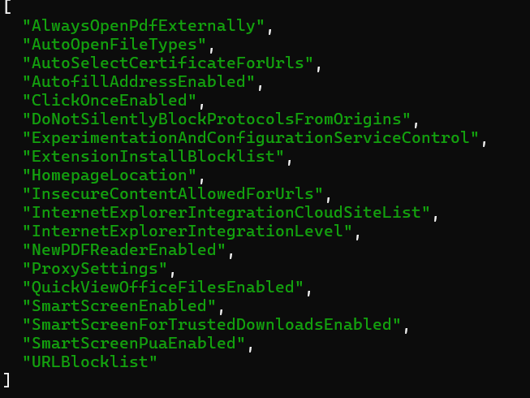

# JSON
JQ command for windows

## Install
    pacman -S mingw-w64-x86_64-jq
## Add to Windows enviroment 
By default jq.exe is installed in 'C:\msys64\usr\bin', add this path to the Windows enviroment system variables Path.

### List Edge Policies
>jq ".policyValues.chrome.policies|keys" samplePolicies.json

### Show Edge policy 
>jq ".policyValues.chrome.policies.HomepageLocation" samplePolicies.json

### Show Edge Sidebar name,id,extension_id.
    jq  ".hub_apps.[]|.name,.id,.extension_id" ../../../desktop/sidebar.json

### Windows map value for have
#### Tips:exclamation:: On windows we need to use slash before '"' if it used nested
    >jq "map(has(\"apple\"))" fruits.json

### Select values
    >jq ".[] | select(.price>0.5)" fruits.json

### fruits.json Sample Data
    [
    {
        "name": "apple",
        "color": "green",
        "price": 1.2
    },
    {
        "name": "banana",
        "color": "yellow",
        "price": 0.5
    },
    {
        "name": "kiwi",
        "color": "green",
        "price": 1.25
    }
    ]

