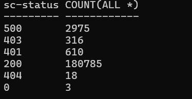

# Search Text from URL
Required Packge: w3m
## Install
    >pacman -S w3m

## Search the package
    >pacman -Ss w3m

## Search [coplilot] key words from Edge policy page
    >w3m -dump https://learn.microsoft.com/en-us/deployedge/microsoft-edge-policies|grep --color=always -i copilot

## Search group policy name about [coplilot] key words from Edge policy page
    >w3m -dump https://learn.microsoft.com/en-us/deployedge/microsoft-edge-policies|grep -i copilot|grep --color=always -i gp

# Sum the total memory used for the specific process on Windows
Required Packge: awk,sed

## Get total memory used by [msedgewebview2.exe] key words from Edge policy page
[PowerShell]

    >tasklist /fi "imagename eq msedgewebview2.exe"|awk '{print $5}'|tail -n +4|sed 's/,//'|  awk '{sum+=$1;} END {print \"total memory=\", sum/1000000 ,\"G\" }'

[Command]

     >tasklist /fi "imagename eq msedgewebview2.exe"|awk '{print $5}'|tail -n +4|sed 's/,//'|  awk '{sum+=$1;} END {print "total memory=", sum/1000000 ,"G" }'

## Get total memory used 
[Command]

    >tasklist |awk '{print $5}'|tail -n +4|sed 's/,//'|  awk '{sum+=$1;} END {print "total memory=", sum/1000000 ,"G" }'

# Logpaser

## Group by IIS logs by the HTTP status code
    >logparser -i:W3C "select sc-status,count(*) from *.log group by sc-status"

## Group by IIS logs by the Request URL Path
    >logparser -i:W3C "select  cs-uri-stem,count(*) from *.log  where sc-status='500' group by cs-uri-stem"

# Grep

## The text file is recoginzed as binary file,use the command below to search the text
    >cat file | tr -d '\000' | grep --color=always -i "keywords"

# Convert File Path Between Unix and Windows

## Convert Unix path to Windows's path
    >cygpath -w .Demo/WIN32-MSVC/WIN32.sln

## Convert Windows path to Unix's path
    >cygpath -u .Demo\WIN32-MSVC\WIN32.sln

## Search string in specific file extension from a folder
    grep -ir "nc" --include "*.md" .

# Set Windows Title from PowerShell and Windows Command
>\>$Host.UI.RawUI.WindowTitle=Split-Path -Path $pwd -Leaf

>\>title helloWorld